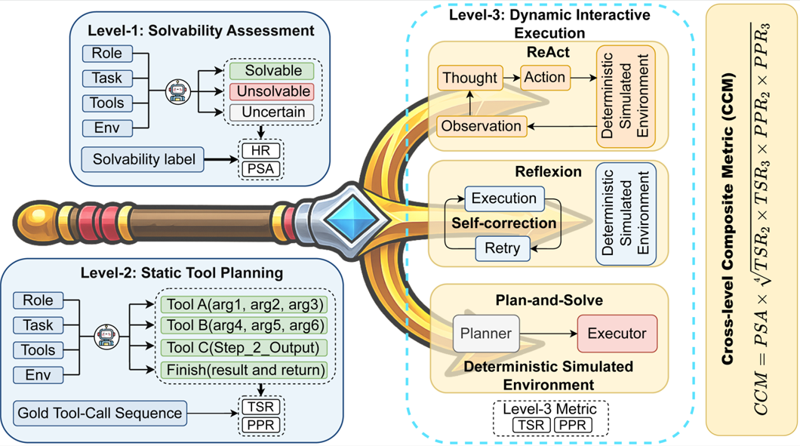
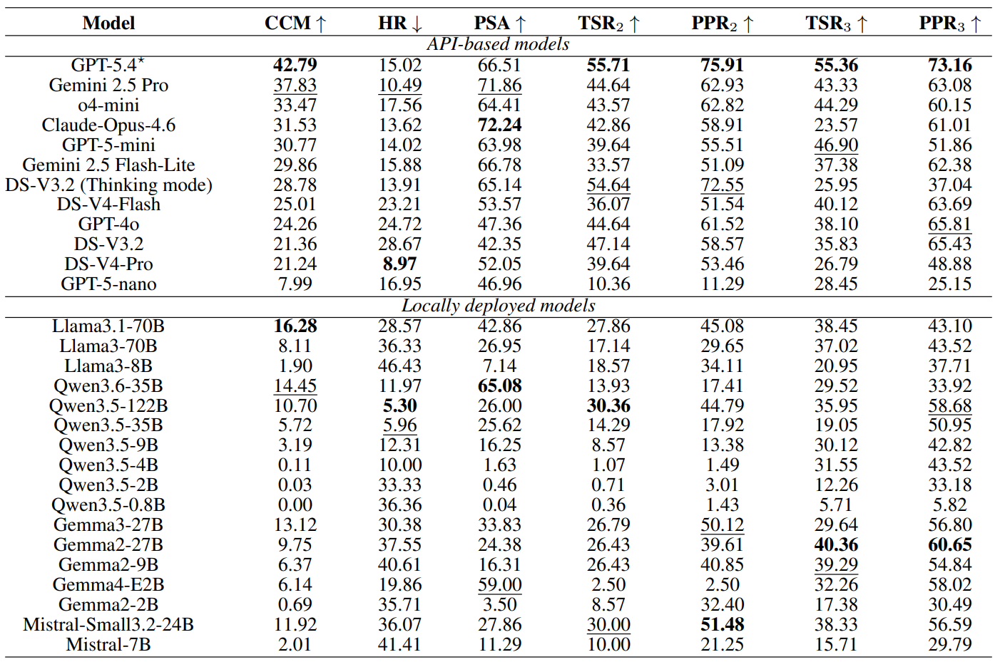

# 🔱 Agent-Trident: A Three-Level Progressive Diagnostic Benchmark for Tool-Use Hallucination in LLM Agents

TRIDENT is a benchmark for evaluating tool-use hallucination in agentic systems. It tests whether a model can correctly decide task solvability, plan valid tool calls, and execute tool-use trajectories in a deterministic simulator.

## 📌 Table of Contents

- [🧭 Overview](#-overview)
- [🔱 TRIDENT Three-Level Diagnostic Framework](#-trident-three-level-diagnostic-framework)
- [🛠️ Environment Setup](#-environment-setup)
- [📦 Data](#-data)
- [🚀 Quick Start: GPT-5.4](#-quick-start-gpt-54)
- [🤖 Run Inference](#-run-inference)
- [📊 Run Evaluation](#-run-evaluation)
- [🧩 Local Open-Source Models with vLLM](#-local-open-source-models-with-vllm)
- [🗂️ Project Structure](#-project-structure)
- [📁 Output Structure](#-output-structure)
- [🧪 Build Your Own Dataset](#-build-your-own-dataset)
- [🏆 Leaderboard](#-leaderboard)

## 🧭 Overview

TRIDENT evaluates tool-use behavior across three levels:

| Level | Evaluation Target | Expected Output |
| --- | --- | --- |
| **Level 1** | Solvability judgment | `solvable`, `unsolvable`, or `uncertain` |
| **Level 2** | Static tool planning | Full tool-call sequence |
| **Level 3** | Dynamic tool execution | ReAct, Reflexion, and Plan-Execute trajectories |

The benchmark is designed around seven tool-use structures and twenty application domains. Each inference script runs Level 1, Level 2, and Level 3 automatically.

## 🔱 TRIDENT Three-Level Diagnostic Framework



## 🛠️ Environment Setup

Create and activate the conda environment:

```bash
conda create -n trident python=3.10
conda activate trident
pip install -r requirements.txt
```

The provided scripts are Bash scripts. On Windows, run them through WSL, Git Bash, or another Bash-compatible shell.

## 📦 Data

The repository includes the following benchmark file:

| File | Description |
| --- | --- |
| `data/trident_benchmark.json` | Sanitized review subset used by the scripts |

TRIDENT is a fully synthetic benchmark. All task scenarios, environments, tool definitions, simulated observations, and gold tool-call sequences are generated for research purposes and do not contain real user data, patient data, crowdworker data, or other real personal information.

During anonymous review, we release a small manually sanitized test subset for reviewer inspection and quick testing. Although the data are synthetic, some generated fields may contain realistic-looking placeholders, such as email addresses, file paths, account identifiers, or system paths, which could be mistaken for real information or author-identifying metadata. The full 1,120-sample benchmark will be included in the public project release upon acceptance.

## 🚀 Quick Start: GPT-5.4

Run inference and evaluation with GPT-5.4:

```bash
export OPENAI_API_KEY="your_openai_api_key"

bash scripts/infer_all_gpt-5.4.sh

bash scripts/eval_all.sh "results/infer_results(trident_benchmark)" data/trident_benchmark.json gpt-5.4
```

For the full benchmark:

```bash
bash scripts/infer_all_gpt-5.4.sh data/trident_benchmark_full.json 10
bash scripts/eval_all.sh "results/infer_results(trident_benchmark_full)" data/trident_benchmark_full.json gpt-5.4
```

## 🤖 Run Inference

Available inference scripts:

| Script | Provider | Default Model |
| --- | --- | --- |
| `scripts/infer_all_gpt-5.4.sh` | OpenAI API | `gpt-5.4` |
| `scripts/infer_all_claude-opus-4-6.sh` | Anthropic API | `claude-opus-4-6` |
| `scripts/infer_all_qwen3.5-35b-vllm.sh` | Local vLLM server | `Qwen/Qwen3.5-35B-A3B` |
| `scripts/infer_all_mistral-7b-vllm.sh` | Local vLLM server | `mistralai/Mistral-7B-Instruct-v0.3` |

API model examples:

```bash
export OPENAI_API_KEY="your_openai_api_key"
bash scripts/infer_all_gpt-5.4.sh data/trident_benchmark.json 10

export ANTHROPIC_API_KEY="your_anthropic_api_key"
bash scripts/infer_all_claude-opus-4-6.sh data/trident_benchmark.json 10
```

## 📊 Run Evaluation

Evaluate one model:

```bash
bash scripts/eval_all.sh "results/infer_results(trident_benchmark)" data/trident_benchmark.json gpt-5.4
```

Evaluate all detected model results:

```bash
bash scripts/eval_all.sh "results/infer_results(trident_benchmark)" data/trident_benchmark.json all
```

Evaluation outputs are written under:

```text
results/infer_results(trident_benchmark)/eval_<model>/
```

## 🧩 Local Open-Source Models with vLLM

Start a vLLM OpenAI-compatible server first, then run the corresponding TRIDENT inference script.

### Mistral-7B

```bash
vllm serve mistralai/Mistral-7B-Instruct-v0.3 \
  --served-model-name mistralai/Mistral-7B-Instruct-v0.3 \
  --host 0.0.0.0 \
  --port 8000 \
  --max-model-len 4096 \
  --gpu-memory-utilization 0.80
```

```bash
export VLLM_API_URL="http://localhost:8000/v1/chat/completions"
export VLLM_MODEL="mistralai/Mistral-7B-Instruct-v0.3"
export MODEL_NAME_SAVE="mistral-7b"
bash scripts/infer_all_mistral-7b-vllm.sh data/trident_benchmark.json 10
```

### Qwen3.5-35B-A3B

```bash
vllm serve Qwen/Qwen3.5-35B-A3B \
  --served-model-name Qwen/Qwen3.5-35B-A3B \
  --host 0.0.0.0 \
  --port 8000 \
  --max-model-len 4096
```

```bash
export VLLM_API_URL="http://localhost:8000/v1/chat/completions"
export VLLM_MODEL="Qwen/Qwen3.5-35B-A3B"
export MODEL_NAME_SAVE="qwen3.5-35b-a3b"
bash scripts/infer_all_qwen3.5-35b-vllm.sh data/trident_benchmark.json 10
```

The request output cap follows the paper setting of `4096` tokens. It is controlled by `VLLM_MAX_TOKENS`, so you can lower it for constrained local hardware when prompt tokens and output tokens do not fit in the served context window.

## 🗂️ Project Structure

```text
TRIDENT/
|-- assets/
|   `-- figures/
|       |-- data-construction-pipeline.png
|       `-- model-leaderboard.png
|-- data/
|   |-- trident_benchmark.json
|   `-- trident_benchmark_full.json
|-- prompt/                      # Dataset generation prompts by task type
|-- scripts/                     # Inference, evaluation, and generation scripts
|-- utils/                       # Generation, processing, evaluation, and reporting utilities
|-- results/                     # Generated inference/evaluation outputs
|-- tools_emb/                   # Generated tool embeddings for evaluation
|-- main.py                      # Main inference/evaluation entrypoint
|-- requirements.txt
`-- README.md
```

`results/`, `tools_emb/`, and Python cache files are generated artifacts and are ignored by `.gitignore`.
Before sharing an anonymous-review archive, review any intentionally included generated output or terminal log because it may contain local paths, configured endpoints, or unreviewed model text.

## 📁 Output Structure

After inference, results are organized by level and strategy:

```text
results/infer_results(trident_benchmark)/
|-- level1/infer_results/results_<model>.json
|-- level2/infer_results/results_<model>.json
|-- level3_react/infer_results/results_<model>.json
|-- level3_reflexion/infer_results/results_<model>.json
|-- level3_plan_execute/infer_results/results_<model>.json
`-- eval_<model>/
```

The path contains parentheses, so quote it in shell commands:

```bash
bash scripts/eval_all.sh "results/infer_results(trident_benchmark)" data/trident_benchmark.json gpt-5.4
```

## 🧪 Build Your Own Dataset

You can use the included generation script as a starting point for building your own TRIDENT-style dataset:

```bash
export GOOGLE_API_KEY="your_google_api_key"
export OPENAI_API_KEY="your_openai_api_key"
bash scripts/generate_single_step.sh
```

By default, generated samples are written to `data/single_step_dataset.json`.

## 🏆 Leaderboard


